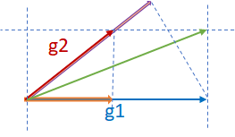

# Adaptation 调研

分布式训练的参数调整基本有以下共识：
* learning rate 需要根据 batch size 调整，以保证训练速度和收敛速度
* learning rate 需要在不同的训练阶段进行调整以保证收敛速度
这个方向早期已经有比较多的研究，包括
* Adam 2015，在 variance 较大时使用较小的 lr
* LARS 2017，在每一层上根据 wieghts 和 gradient 适配 lr
* LARM 2019，LARS + Adam

## Summary
最新的一些参数适配相关的研究进展：

| 方法 | 年份 | 适用 | 作用于 | Key Idea | 会议 | 开源 |
| --- | --- | --- | --- | --- | --- | --- |
| GNS | 2018 | | | | |  |
| K-FAC | 2019 | - | gradients | Gradient second-order | cvpr2019 |  |
| AdaScale | 2020 | SGD | lr | Gradient variance | ICML2020 |  |
| Resource Elasticity...  | 2020 | tf | framework | Worker performance | mlsys2020 |  |
| Kungfu | 2020 | tf/torch | - | implementation | osdi20 | [KungFu](https://github.com/lsds/KungFu) |
| Pollux | 2021 | | | | osdi21 | [adaptdl](https://github.com/petuum/adaptdl) |
| Adasum | 2021 | Momentum-SGD, Adam, and LAMB | gradients | combine gradient | mlsys2021 | [horovod](https://github.com/horovod/horovod) |
| | | | | | |  |

An Empirical Model of Large-Batch Training
Sam McCandlish et al. OpenAI
总结：文章提出了 gradient noise scale (GNS) 指标，
* GNS 较小，保持 batch size
* GNS 较大，增大 batch size
GNS 定义如下：

$$
B_{noise} = \frac{tr(H\Sigma)}{G^T H G}

$$

其中：
* $G$ true gradient
* $H$ true Hessian at parameter values
* $\Sigma$  covariance matrix

### AdaScale SGD: A Scale-Invariant Algorithm for Distributed Training
Tyler B. Johnson et al. APPLE

Key: Gradient variance

总结：adascale 根据 gradient variance 来调整 learning rate，提供稳定算法保证在不同的 batch size 下都能找到合适的 lr 保证快速收敛。

### Scaling distributed training with adaptive summation
Saeed Maleki et al. Microsoft Research

总结：adasum 利用 gradients 自身的数学性质，提出了一种新的 combine 方法，使得 merge 结果受 outlier 影响较小，更加“合理”，从而加快收敛。
算法公式

$$
\vec{g} =
\left(1-\frac{\vec g_1 \cdot \vec g_2}{2 |\vec g_1|^2}\right) \vec g_1
+
\left(1-\frac{\vec g_1 \cdot \vec g_2}{2 |\vec g_2|^2}\right) \vec g_2
$$

示意图

  

### Large-Scale Distributed Second-Order Optimization Using Kronecker-Factored Approximate Curvature for Deep Convolutional Neural Networks
Kazuki Osawa et al. Tokyo Institute of Technology, NVIDIA

Key: Gradient second-order metrics

总结：通过计算 Fisher 矩阵二阶信息来更新梯度，每一步的计算速度会慢于sgd，但收敛所需步数减少，特别是在large scale 的场景，整体效率接近。

### Resource Elasticity in Distributed Deep Learning
Andrew Or et al. Princeton University, Google AI

autoscaling engine/system

总结：文章对分布式场景深度学习场景下的弹性系统进行了比较全面的梳理，着墨较多在弹性触发条件，但是对系统实现没有什么深入描述，这块创新性存疑。文中提到了依赖 tensorflow 和 horovod，姑且认为，默认实现方案为 horovod 吧。
文中涉及到了类似慢节点检测的机制（STRAGGLER DETECTION）。

### KungFu: Making Training in Distributed Machine Learning Adaptive
Luo Mai et al. Imperial College London

总结：kungfu 提供了一个统一的框架/库用来在分布式训练场景下进行不同 adaptation 操作，包括 api、monitor、control 等部分。
* 提供 adaption policies 来定义不同 adaption
* 内置 monitoring，使得依赖各种 metric 做 adapt 决策变得容易
* 分布式参数 adpating 机制：提供弹性、异步 collective

### Pollux: Co-adaptive Cluster Scheduling for Goodput-Optimized Deep Learning
Aurick Qiao et al. Petuum, Inc, CMU, UCB, MBZUAI.

总结：提出 goodput 指标用于计算优化配置，包括资源和参数 lr、bs。兼容其他如 adascale 策略。

