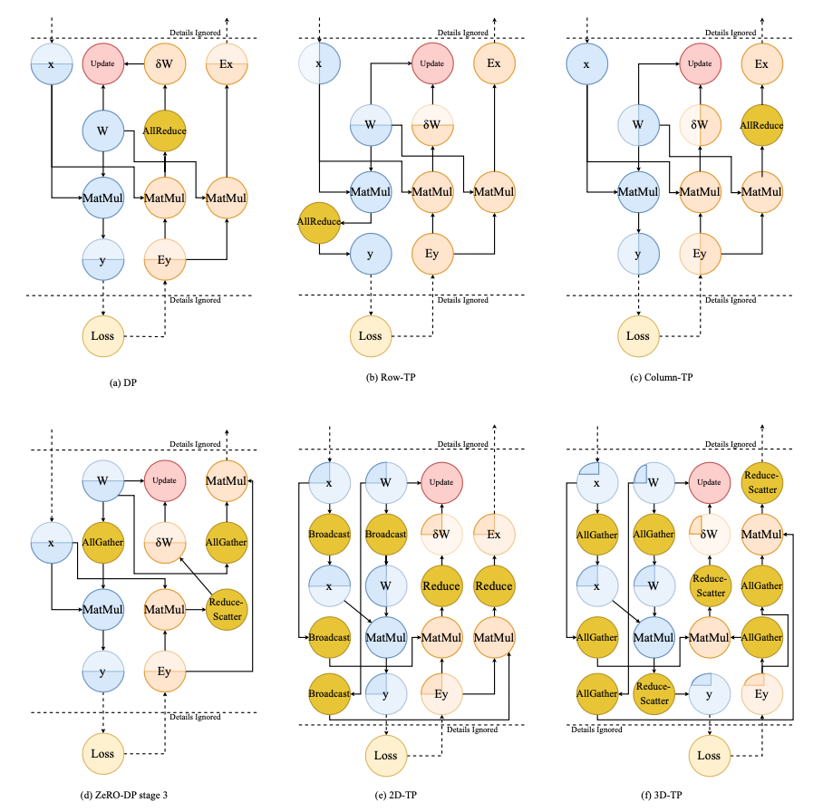
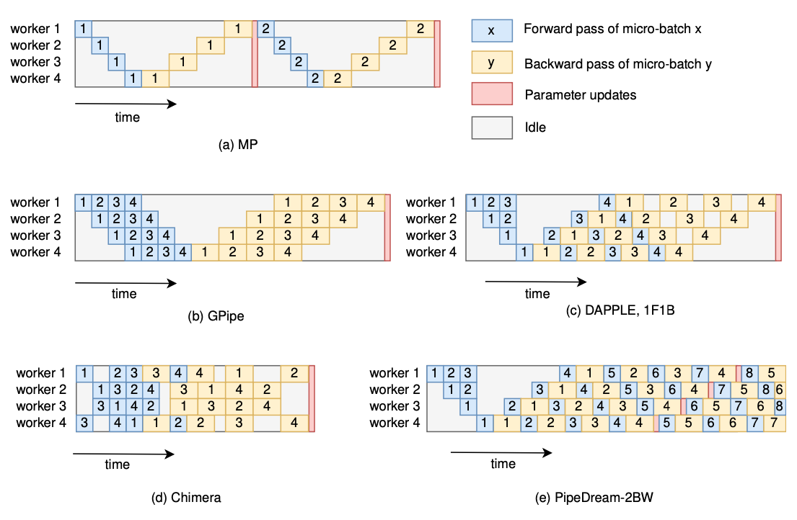

# Auto Parallel

## A Survey on Auto-Parallelism of Neural Networks Training

Peng Liang et. al. National University of Defense Technology

### Abstract.

DL --> large model --> distributed training --> heterogeneous cluster --> auto-parallelism --> large scale DL model

* basic parallelism schemes, communication cost and memory consumption
* current works, strategies, common methods
* promising trends

### Introduction

Parallelism strategy
* intra-operator parallelism: data parallelism, tensor parallelism (intra-layer model parallelism)
* inter-operator parallelism: inter-layer model parallelism, pipeline parallelism

Hybrid parallelism
* data + model + pipeline
* Megatron-LM, DeepSpeed(3D parallelism)

Manual --> Auto

All practicable works: a few combinations of parallelism schemes, weak scalability
* e.g. cost model
* automatic parallelism search space can be further expanded
* heterogeneous devices, communication pace/topology

### Challenges

* detailed analysis of different parallelism schemes
* trade-offs between different parallelism schemes
* load-balance across heterogeneous devices
* optimization of network communication
* trade-off between runtime and strategy performance in finding strategy

### Parallelism schemes

Data parallelism

* Vanilla DP
* ZeRO-Powered DP
* Communication of DP, Centralized/Decentralized architecture

ZeRO-DP
* three stages: 1 partition optimizer states, 2 partition gradients and optimizer states, 3 partition parameters
* stage 1 and 2: reduce-scatter accumulated gradients, stage 3: all-gather updated parameters
* solve redundancy problem with 50% more communication volume (all-gather)

Model parallelism
* Intra-layer MP, tensor parallelism, partition weight tensor
* Inter-layer MP

  

Pipeline parallelism

The partition pattern of PP is the same as that of MP
* inter-layer MP = PP
* PP = well scheduled pipelined MP
* overlap computation, solve low-utility of MP

PipeDream (Microsoft), GPipe (Google)

  

### Strategy Searching Methods for Auto-Parallelism

* NP-hard problem
* classic-algorithm-based v.s. machine-learning-based

Classic-algorithm based methods
* recursive algorithm
* dynamic programming algorithm
* integer linear programming algorithm
* breath-first-search (BFS) algorithm

Machine-learning based methods
* Monte-Carlo Markov Chain (MCMC)
* Monte-Carlo Tree Search (MCTS)
* reinforcement learning

### Conclusion

Accelerating strategy searching
* grouping
* profiling-base cost model
* using heuristics

Optimizing parallelism strategies
* topology-aware computation
* topology-aware communication

Supporting more parallelism schemes

